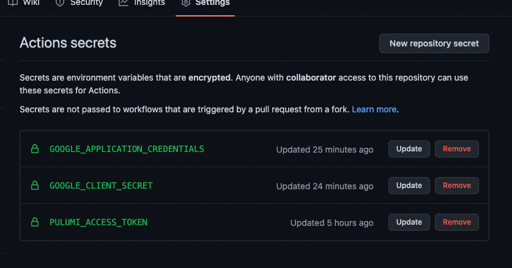

# YamlTube: YouTube Playlists in Yaml

Manage your YouTube playlists in YAML on GitHub. Just fork this repo and follow the [setup instructions](#setup-instructions)

[Edit YAML](https://github.dev/mchaynes/yamltube/Pulumi.yaml)

## Who is this for?

To be honest, I have no idea. It seemed like a funny concept and yamltube.com was $12.

## Demo


## Anyways, this is how you define a playlist:

```yaml
name: yamltube
runtime: yaml
description: Manage Your YouTube playlist in yaml
resources:
  makingmyway:
    type: yamltube:youtube:Playlist
    properties:
      title: Making My Way
      description: I guarantee you know these songs
      visibility: public # or private or unlisted
      videos:
        - https://www.youtube.com/watch?v=Cwkej79U3ek
        - https://www.youtube.com/watch?v=iPUmE-tne5U
        - https://www.youtube.com/watch?v=b7k0a5hYnSI
        - https://www.youtube.com/watch?v=qi7Yh16dA0w
        - https://www.youtube.com/watch?v=gte3BoXKwP0
        - https://www.youtube.com/watch?v=KU5o6M7S5nQ
        - https://www.youtube.com/watch?v=znlFu_lemsU
        # not supported yet
        # merge in another playlist into this one
        # - https://www.youtube.com/playlist?list=PLeQFt2AXw9mSQpqcBfHkufqpBsS2x4hTD
        # or this way works too, it just ignores the video
        # - https://www.youtube.com/watch?v=BdEe5SpdIuo&list=PLeQFt2AXw9mSQpqcBfHkufqpBsS2x4hTD
  rickroll:
    type: yamltube:youtube:Playlist
    properties:
      title: Rick Roll
      description: I'm sorry
      visibility: public
      videos:
        - https://www.youtube.com/watch?v=dQw4w9WgXcQ
outputs:
  # output links
  rickrollLink: https://www.youtube.com/playlist?list=${rickroll.playlistId}
  makingmywayLink: https://www.youtube.com/playlist?list=${makingmyway.playlistId}
```

## Future Work: Spotify Playlists?

```yaml
name: yamltube
runtime: yaml
description: a spotify playlist
resources:
  makingmyway:
    type: yamltube:spotify:Playlist
    properties:
      title: Walkin Fast
      tracks:
        - link: https://open.spotify.com/track/4w1lzcaoZ1IC2K5TwjalRP
        # or
        - title: A Thousand Miles
          artist: Vanessa Carlton
          album: Be Not Nobody
        # or
        - isrc: USIR10210955 # https://www.isrcfinder.com/
outputs:
  # outputs link like: https://open.spotify.com/playlist/37i9dQZF1DX8NTLI2TtZa6
  makingmywayLink: ${makingmyway.link}
```

## Setup Instructions

### 1. Fork this repo

Pretty straightforward

But, if you want to have a private repo, just create a blank repo on github, then do this:
```sh
  git clone https://github.com/mchaynes/yamltube.git
  cd yamltube
  git remote add private git@github:mchaynes/private.git
  git push private main
  👁👄👁
```

### 2. Sign up for Pulumi and install the CLI.

1. You can probably just do a `brew install pulumi && pulumi login`. Or go read the [docs](https://www.pulumi.io/)
2. Obtain a [Pulumi Access Token](https://www.pulumi.com/docs/intro/pulumi-service/accounts/#access-tokens)

### 3. Get Credentials To Access YouTube API

Obtain a `client_secret.json` for your account. Follow this [Guide](https://developers.google.com/youtube/v3/guides/auth/server-side-web-apps) to get the file. (Sorry, no Pulumi program for this)

### 4. Generate `application_credentials.json`

Run `go build && ./verify`

```
$ go build && ./verify
Rick Roll              https://www.youtube.com/playlist?list=PLeQFt2AXw9mQpVhWC5lS7zst-WAcubVk5
Making My Way Downtown https://www.youtube.com/playlist?list=PLeQFt2AXw9mQNM6J7WA_v37PvOdXBYtG-

Successfully saved ./application_credentials.json
Run:
    export GOOGLE_APPLICATION_CREDENTIALS="$(cat ./application_credentials.json)"
    export GOOGLE_CLIENT_SECRET="$(cat ./client_secret.json)"
```

### 5. Modify and create your playlists

Modify `Pulumi.yml` and add your playlists
Run `pulumi up`

```sh
❯ pulumi up
Please choose a stack, or create a new one: myleschaynes
Previewing update (myleschaynes)

View Live: https://app.pulumi.com/myles/yamltube/myleschaynes/previews/<redacted>

     Type                          Name                   Plan
 +   pulumi:pulumi:Stack           yamltube-myleschaynes  create
 +   ├─ yamltube:youtube:Playlist  makingmyway            create
 +   └─ yamltube:youtube:Playlist  rickroll               create

Resources:
    + 3 to create

Do you want to perform this update? yes
Updating (myleschaynes)

View Live: https://app.pulumi.com/myles/yamltube/myleschaynes/updates/1

     Type                          Name                   Status
 +   pulumi:pulumi:Stack           yamltube-myleschaynes  created
 +   ├─ yamltube:youtube:Playlist  rickroll               created
 +   └─ yamltube:youtube:Playlist  makingmyway            created

Outputs:
    makingmywayLink: "https://www.youtube.com/playlist?list=PLeQFt2AXw9mS-8BzL96OkySMOTArBTA0O"
    rickrollLink   : "https://www.youtube.com/playlist?list=PLeQFt2AXw9mSQKAyZTPhMvO080-mOAkMJ"

Resources:
    + 3 created

Duration: 4s
```

### 6. Github Actions Setup (Optional, but you really should)

Go to your forked repo, click `Settings` > `Secrets` > `Actions`

```
+--------------------------------+--------------------------------------------+
|          Secret Name           |                   Value                    |
+--------------------------------+--------------------------------------------+
| GOOGLE_CLIENT_SECRET           | contents of ./client_secret.json           |
| GOOGLE_APPLICATION_CREDENTIALS | contents of ./application_credentials.json |
| PULUMI_ACCCESS_TOKEN           | <token> from ui                            |
| STACK_NAME                     | name of the pulumi stack                   |
+--------------------------------+--------------------------------------------+
```


